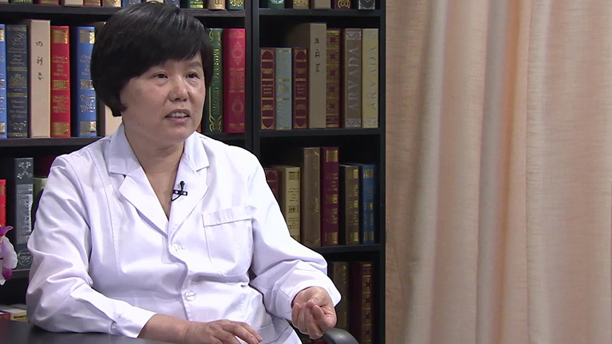

# 1.1 艾滋病、梅毒、乙肝的母婴阻断

---

## 刘敏 主任医师

北京地坛医院妇产科主任 主任医师；中华医学会感染病分会产科感染与肝病学组委员；北京医学会计划生育分会常委；北京医学会围产医学分会委员；北京市妇幼卫生保健专家组成员；北京市计划生育技术服务专家委员会专家；北京市预防艾滋病母婴传播技术专家指导组专家。

**主要成就：** 参加多项国际、国内的乙肝母婴阻断的研究，撰写论文数篇。

**专业特长：** 擅长妇产科常见病、疑难病的诊治，对病理产科、产科危重症的抢救有较丰富的经验，熟练完成各种妇产科手术，如开腹子宫切除、阴式子宫切除、复杂子宫内膜异位症手术、卵巢癌手术、宫颈癌根治术，各种剖宫产手术、产钳术等，熟练掌握宫腔镜及腹腔镜微创技术，对传染病合并妇产科疾病的诊断和治疗有丰富的经验，特别是对肝病合并妊娠、乙肝的母婴传播，有较深入的研究。

---

## **母婴阻断是怎么回事？**

像有一些经血传播的疾病，比较多的就是艾滋、梅毒、乙肝这些疾病，一般有可能通过怀孕的母亲传播给胎儿，叫母婴传播。

通过医学干预，让有传染病的母亲生出的孩子不再有传染病，这个叫做母婴阻断。

母婴阻断的途径一般有宫内传播，分娩过程传播，还有产后传播，这三个途径，所以宫内传播占一部分，分娩过程中占了其实很大一部分。

分娩过程当中，胎儿会接触含有病毒的血液、体液，所以分娩过程当中其实是一个很重要的传播途径。

还有产后，乳汁当中也是含有病毒的，可能比血液当中会低一些，如果喂奶，或者与婴儿密切接触汗液、体液，都是可能造成孩子被感染。
阻断母婴传播也就从这三方面去入手，宫内的时候想办法进行干预，再有就是分娩过程当中干预，还有就是产后的干预。

具体到艾滋、梅毒、乙肝，可能各有不同，母婴阻断其实是一个比较复杂的过程，工作做得非常好才能达到一个比较理想的阻断效果，生出一个健康的宝宝，让孩子不再有妈妈患有的疾病。

---

## 患有乙肝、艾滋病、梅毒的母亲还能生出健康的孩子吗？

乙肝传播主要和乙肝母亲体内病毒载量相关，如果母亲是乙肝大三阳，病毒量非常高，感染给孩子的机会可能就会更多一些。

如果是小三阳，病毒阴性的话，可能母婴传播的机会就会少一些，主要和病毒载量相关，所以现在一定要评估，只有很少部分人可以先治疗乙肝再怀孕，其他一些人可能年龄也比较大了，肝病时间可能也比较长，可能也不太适合先治疗，怀孕之后在孕期再干预治疗，这样也能取得很好的效果。

乙肝还是比较复杂的，要根据乙肝病情决定治疗时机，是在孕前还是孕期治疗，要个体化，根据不同的病人选择不同的治疗方案。

像艾滋病，如果经过抗病毒治疗之后，把病毒降到了测不出来的水平，艾滋病的母婴传播阻断率是非常高的，非常理想的，如果进行很好干预的话，即便是艾滋病的妈妈，感染给孩子机会，也就只有1%到2%。

以前觉得得了艾滋病，可能就很绝望，觉得自己可能也活不了多长时间了，这个病也没法治疗，其实不是这样的，艾滋病这些年来治疗确实进展很快，新药也越来越多，如果艾滋病能够早发现、早治疗，可以和正常人一样的去生活，艾滋病人也同样要求有做母亲的权利，家庭幸福美满，大家有这样的追求。

现在艾滋病病人长期存活之后，生孩子的确实越来越多，2000年的时候，我们接第一例艾滋病孕妇的时候，我们自己也觉得，得了艾滋病怎么还生孩子呢，挺不能理解的，现在每年可能也会接收10-20个艾滋病产妇，逐渐增加，有艾滋病的妈妈也生二胎的，说明人家生活得非常好，孩子也非常健康。

随着艾滋病治疗越来越进展，艾滋病病人长期的一个存活，生孩子的会越来越多，但是一定要在医生指导下，进行标准干预，如果不干预，艾滋病妈妈生出的孩子感染的机会还是很大的，包括出生之后母乳喂养，孩子可能大概会有百分之四五十感染风险，风险还是很高的，所以干预很重要。

其实这些疾病，经过科学发展，母婴阻断技术越来越成熟，确实使有传染病的母亲，生出健康宝宝的机会，还是非常大的。

还有就是梅毒，梅毒如果能够很好进行治疗干预，完全可以生出健康的孩子，没有一点点的风险，但如果不进行干预，不治疗，一个梅毒的母亲要想生孩子，妊娠结局是非常糟糕，非常差的，但如果经过正规去梅治疗，生出孩子完全可以是健康的，没有一点点的风险。

---

## 如何有效预防艾滋病、梅毒、乙肝等传染疾病的母婴传播？

预防母婴传播如果能在孕前做检查是最理想的，因为好多孕妈妈都是在孕前来检查，孕前检查时候发现比如艾滋、梅毒、乙肝，孕前根据病情分析，如果需要治疗就进行治疗。

尤其像梅毒如果能在孕前发现，然后正规治疗，梅毒是可以治愈的，治愈之后再怀孕就完全可以预防母婴传播风险。

艾滋病也是这样，艾滋病如果能在孕前发现，然后抗病毒治疗，把病毒降到测不出来的水平再怀孕，进行孕期和分娩期，包括产后的干预，也基本上也可以生出一个健康的宝宝。

乙肝也是这样，也是主张在孕前进行一个评估，因为乙肝是一个慢性病，不好治疗，不像梅毒一样，一治就治的非常好，我们要来评估，根据肝病情况，病毒载量的高低，包括她的年龄，来综合判断，是先治疗还是先怀孕。

可能有的病人非常年轻，然后肝病得的时间也比较短，近期也不想怀孕，可能会有三年、五年的时间治疗，我们可以试着进行一些治疗，尽管可能不一定百分之百的治好，但把乙肝高病毒降到低病毒，这个机会还是有的。

乙肝治疗不是很理想，并不是所有人经过一段时间治疗，达到这么理想的效果，所以现在就是一定要评估，只有很少部分人可以先去治疗乙肝再怀孕，其他的一些人可能年龄也比较大了，肝病的时间可能也比较长，可能也不太适合先治疗，怀孕之后在孕期再干预治疗，这样也能取得很好的效果。

乙肝还是比较复杂的，要根据乙肝病情，来决定治疗时机，是在孕前还是孕期治疗，要个体化，根据不同病人选择不同治疗方案。

艾滋病现在的治疗原则，只要发现艾滋病病人，马上都要进行治疗，就是控制病毒，控制到测不出来的水平，对于怀孕来说，也就把母婴传播的风险降到了最低，治疗之后病情稳定了，然后就可以考虑怀孕，在有准备的情况下怀孕，可能都会比较理想，能在孕前治疗是最理想的。

如果孕前不知道自己得了艾滋病，在孕期才发现，可能相对来说就会比较麻烦，所以我们现在主张，要想预防这些疾病，就希望能在孕前做检查，尤其是一些传染病，孕前检查是非常重要的。

有的人孕检可能到怀孕三个月，十二周再查来得及，对于像这种经血传播疾病，如果能早一点检查发现，刚刚怀孕来检查也是可以的，因为有些人确实是不知道自己有这些疾病，包括艾滋、梅毒、乙肝，自己并不是清楚，好多是在怀孕的时候才发现的，所以我们觉得能在孕前检查是最理想。

不能在孕前检查，在早孕的时候，第一次来孕检的时候查一下，如果发现了赶紧进行治疗，这样话可能就不会错过最佳治疗时机，会好很多，有些已经错过了时机，至于什么时候干预，要根据个人的情况来决定。

---

## 患有梅毒、艾滋病、乙肝的孕妇母婴阻断的最佳时机是什么时候？

像梅毒应该是在孕前做检查，一旦发现孕前治疗，如果是在怀孕当中发现了梅毒，也是一旦发现要立刻治疗，越早越好，因为梅毒对孩子的影响非常大，梅毒就是发现了就治疗。

如果能在怀孕头三个月之内治疗是最理想的，如果是四个月、五个月，稍微晚一点发现，也要赶紧治疗，然后到28周的时候还要第二次治疗，一定要还要再给她一次治疗，梅毒要两次治疗，才叫规范治疗，早孕和28周这两次治疗，都非常非常重要。

像艾滋病，已经用上抗病毒治疗了，抗病毒药不能停，一直要吃下去，要怀孕的话可能要注意一下，原来抗病毒药物是不是对胎儿有一些刺激，不好的影响，一定要换成相对比较安全的，在孕期能用的抗病毒药物，对孩子副作用比较小的药物。

抗病毒药是一定不能停的，只有抗病毒药物一直在吃，而且病毒维持在测不出来的水平，这样的话才能达到很好的母婴阻断效果，一停药的话病毒载量就会上来，母婴传播的机会就要增加。

对于乙肝来说，要根据病毒载量的高低，如果是病毒非常高，肝功能是正常的，这种就不主张很早进行干预，到28周的时候给她抗病毒药物治疗，减少宫内传播就可以了。

如果病毒不是很高，一般我们把106作为界限，小于106一般孕期没有什么特殊的干预，但是要注意肝功能变化，有的病人可能平常是乙肝携带，肝功都是正常的，怀孕之后肝脏负担的加重，肝病加重，出现肝功能异常，转氨酶升高，所以这时候要注意对肝病的监测，包括病毒载量也要注意，尽管一般情况下变化不大，但有时候可能病毒有比较大的变化，所以我们一般要注意，肝功变化和病毒载量的变化。

如果病毒载量一直都是在106以下，而且肝功能是正常的，这种情况下孕期就只是监测，不需要进行什么干预就可以了，如果肝功出现了异常，而且病毒载量又比较高，这个时候一般进行保肝治疗，如果治疗效果不好，肝病越来越重，可能会提前一点用抗病毒药物治疗，如果肝功能正常，病毒还很高，一般选择孕28周抗病毒就可以。

这是艾滋、梅毒、乙肝的母婴阻断，病不一样孕期干预也稍微有点不同。

---

## 患有艾滋病、乙肝的孕妇把病毒抑制住就能减少母婴传播吗？

艾滋病要想彻底治愈很难，现在很多抗病毒药物，能把病毒量降低到，测不出来的水平，效果还是非常好的。

现在乙肝的抗病毒药，其实真正的是抑制病毒，没有清除病毒，只把病毒抑制，病毒暂时不复制，血中病毒载量比较低，所以高病毒载量的时候，对乙肝病人我们建议抗病毒治疗，如果病毒很低，不是特别高，106以下，本身母婴传播风险也不是很大，就不一定都要去进行抗病毒治疗。

所以艾滋病也好，乙肝也好，都是抗病毒，都是抑制病毒，只要吃药就把病毒控制在测不出来水平，现在这些药物都是能达到的。

但是抑制并不是彻底清除，所以一旦药物停了，病毒可能就复制，又活跃起来了，所以不能彻底的治好，不能彻底的清除，但是短时间内把病毒载量，控制在一个很低的水平，尤其在孕期，这个时间并不是很漫长，把病毒一直都维持在一个低水平，这样的话减少宫内感染的风险，还是能做到的。

---

## 孕期服用艾滋病、乙肝抗病毒药物对胎儿影响大吗？

关于抗病毒药物对胎儿是不是有影响，这个问题其实这些年确实研究了很多，总的来看这些抗病毒药物是利大于弊。

艾滋病的抗病毒药物，可以让孩子不得艾滋病，大家肯定还是认为，得了艾滋病是一个灾难，尽管现在艾滋病的一些抗病毒药物，有可能对孩子造成一些不良影响，但总体来说问题不大，还是比较安全的。

从利弊得失来看，抗病毒药物在临床应用利大于弊，绝对的安全肯定是没有的，但是总体来说，对于母婴阻断来说还是可以的。

像艾滋病用的抗病毒药，可能量和种类多一点，也是比较安全的，像乙肝我们现在用的就是一种药，而且一般都会选择在28周以后再用，28周的话孩子基本已经发育成熟了，这时候可能用药的影响也是比较小的。

所以现在看这些抗病毒药物，总体来说它的安全性还是比较高，风险不能说一点没有，但是总体来看利大于弊，还是可以选择使用的。

---

## 孕妇感染了梅毒后对胎儿会有哪些影响？

梅毒这个疾病对于孩子的影响还是非常大的，如果是两年以上的梅毒，可能影响就会小很多，如果在怀孕期间感染了梅毒，这个就风险太大了，几乎很难生出健康的孩子，绝大多数可能就会发生胎死宫内、流产、早产，孩子即便出来了，可能也是个先天梅毒的孩子，也不一定能健康的活多长时间。

如果是一个没有治疗过的梅毒，这样的女性怀孕生孩子，几乎很少能生出一个健康的孩子，怀孕过程当中直接就感染胎儿，胎儿会发育不好，胎死宫内，或者是孩子生出来，就是一个梅毒的孩子，这种感染机会非常非常多。

所以没有治疗过的梅毒，想生出一个健康孩子，可能性很小，梅毒一定是在孕前进行治疗，如果是一个二期梅毒，梅毒比值非常高，在早孕的时候可以考虑不要这个孩子。

如果月份已经很大了，然后梅毒比值也很低，可能病情相对来说轻一点的，赶紧给她进行治疗，可能孩子感染的风险就会大大降低。
如果梅毒比值相对高一点，孩子感染的风险也还是有的。

对于梅毒来说，治好再怀孕是最理想的，不像其它的疾病不能完全治愈，对于梅毒是能治好的，用青霉素治疗是完全可以治愈的，治愈之后怀孕跟正常人一样，一点风险没有，所以还是建议孕前发现，孕前治疗，或者是早期发现，怀孕三个月之内发现赶紧治疗，这样效果也是好的。

如果真的是在孕晚期才发现治疗，孩子感染的风险可能就会大一些。

早孕的时候要筛查梅毒，觉得筛查一次可能就够了，对于高危人群，我们建议在孕晚期的时候再筛查一次，什么叫高危人群？从外表不一定能够识别出这个高危人群，所以现在我们也希望，对于所有的孕妇，如果经济条件允许的情况下，尽量在孕晚期再筛查一次，一些早孕时候可能没有问题，在怀孕过程当中得了梅毒，这样能早发现早治疗。

我们也遇到过早孕筛查没有梅毒，一般认为孕期可能就不会有什么问题了，然后孩子生出后，大家觉得很这个孩子很异常，很像一个梅毒，进行梅毒筛查，果然是一个先天梅毒，先天梅毒一定是母婴传播的，再反过来一查妈妈，果然是一个梅毒，再仔细追查早孕的时候竟然没有梅毒，在孕期有了被感染的机会，然后孩子也感染了，这种情况也是有的，孕期避免高危的一些性行为，这些其实很重要。

---

## 患有乙肝的孕妇打疫苗能阻断对胎儿的传播吗？

过去可能人说打乙肝免疫球蛋白，进行乙肝母婴阻断，现在研究结果来看，孕期进行乙肝免疫球蛋白注射，应该是没有什么效果的，这个我们也研究了很多，也有好多文章报道。

从理论上讲也是这样，对于高病毒载量的病人，我们给她注射一点点的免疫球蛋白，是达不到一个很好降病毒效果的，也就达不到母婴阻断的效果。

免疫球蛋白其实就是乙肝抗体、抗原的一个中和，抗原太多，少量抗体进去，对于抗原的中和作用，其实是达不到降低病毒效果的，所以现在孕期进行免疫球蛋白接种，其实是没有什么效果的，出生以后给孩子进行疫苗球蛋白接种，这个效果是非常好的，孕期应该是抗病毒治疗，是现在公认的而且有效的治疗方法。

---

## 乙肝“大三阳”孕妇比“小三阳”孕妇更容易感染给胎儿吗？

一般乙肝病人要查乙肝五项，乙肝五项包括，第一是乙肝表面抗原，第二是乙肝表面抗体，第三是乙肝e抗原，第四是乙肝e抗体，第五是乙肝核心抗体，叫乙肝五项。

一三五，就是表面抗原、e抗原，还有核心抗体阳性，叫大三阳，一四五就是表面抗原、e抗体、核心抗体阳性，叫小三阳。

大三阳e抗原阳性的时候，一般就是病毒复制比较活跃，病毒量比较高，可能感染的风险更大一些，像小三阳，就是表面抗原阳性，e抗体阳性，不是e抗原阳性，这时候一般病毒相对来说，复制的就不那么活跃，病毒一般认为是阴性，这种相对来说风险就低一点。

乙肝病人都很了解自己是大三阳还是小三阳，一定要了解一下，以前就查一个表面抗原，不进一步检查，就知道是一个乙肝携带，但是不知道是大三阳还是小三阳，现在还是一定要查一下乙肝五项，同时还要查乙肝病毒载量，两个结合一下。

基本大三阳病毒载量比较高，小三阳的病毒载量相对低一点，一般都是这样，除非特殊病毒变异的时候，可能会有一点点不一致，包括乙肝携带的病人，我们都是建议，每半年到一年进行乙肝五项，还有乙肝病毒载量，还有肝功能的检测，看看有没有什么变化，像肝脏B超检查，这些都是有必要的。

对于肝病可能这一段时间，有的人可能不会有什么太大变化，乙肝携带的病人可能会不知不觉当中，就会变成慢性乙型肝炎、肝硬化、肝癌，这些机会都是有的，所以对于乙肝携带的病人来说，一定要进行定期的随访检测，是非常重要的。

（采访）孕妇大三阳比小三阳更容易传播给婴儿？

是这样的，所以我们现在进行干预的话，孕期给抗病毒药物治疗的，绝大多数都是大三阳的，病毒比较高的，大于106的，进行干预，小三阳的话婴儿出生后进行疫苗球蛋白的接种，就已经达到很好的阻断效果了，大三阳可能还有少部分会造成母婴阻断失败。

---

## 如何做好母婴阻断才能达到良好的效果？

其实母婴传播阻断，不单单就是抗病毒治疗，其实包括孕前干预，孕期干预，孕期干预就是怀孕期间用药物，把病毒降到测不出来的水平，还包括分娩分娩期的干预，还有产后干预。

产后母亲跟孩子密切接触、哺乳，其实都会造成母婴传播，其实孕期、分娩、产后都会发生，干预也是从孕前、孕期、分娩、产后进行，综合处理才能达到比较好的一个阻断效果。

像艾滋病，我们孕期进行抗病毒治疗了，分娩时要选择合适正确的分娩方式，产后主张人工喂养，孕期、分娩和产后综合干预，才能达到理想阻断效果，像艾滋病宫内抗病毒治疗确实占了很重要的地位。

像乙肝，婴儿出生之后，给他进行乙肝疫苗和乙肝免疫球蛋白接种，起到非常大的作用，即便孕期不进行干预，出生之后给孩子打上疫苗和免疫球蛋白，阻断率已经很理想了，平均阻断率能达到95%，即便是大三阳的话，也能达到90%的阻断率，所以分娩之后疫苗和免疫球蛋白接种，是非常非常重要的。

产后母乳喂养问题，艾滋病我们主张人工喂养，乙肝因为出生之后打了疫苗和免疫球蛋白，孩子主被动免疫进行以后，有一定的抵抗力了，进行母乳喂养应该问题不是特别大，但其实乙肝病人在喂奶的问题上，也是要加强对孩子的一个监测，看他的抗体是不是足够，有足够的保护作用，我们才能放心去喂奶，如果他的抗体产生不好，抗体非常低，这时候喂养其实也会增加感染风险的。

像梅毒如果经过治疗之后，梅毒是完全可以治愈的，完全治疗之后比值下降了，说明治疗有效了，没有传染性了，这时候其实喂养是可以的，但如果治疗之后，治疗的不满意，还有传染性，就不建议母乳喂养。

所以母婴传播阻断，要从孕期、分娩、产后这三方面都做好，才能让阻断效果更好，哪一点做得不好，可能这个阻断效果都要受到一定的影响。

---

## 患有艾滋病、梅毒、乙肝的孕妇在孕期要注意哪些事？

像艾滋病病人，本身可能身体免疫不健全，免疫功能不好，可能有各种的感染机会，各种疾病都容易发生，尤其用一些抗病毒药物，孕妇本身就容易贫血，再用上抗病毒药物之后，可能有的药物也是会造成贫血的，所以像进行抗病毒治疗的艾滋病孕妇，包括贫血问题，肝肾功问题，可能都容易发生，所以一定要对母亲身体状况，进行比较严格的一个监测。

再有就是孩子，妈妈是艾滋病，可能他的营养状态，身体状态不一定特别好，我们要对宫内的胎儿，进行很好的一个监测，孩子是不是能够正常发育，不要出现发育的异常。

像乙肝，有的乙肝病人可能孕期容易出现肝病加重，肝功异常，所以一定要注意肝功能监测，平常经常会给乙肝病人复测肝功，有的病人就说怎么老给我查肝功，以前肝功从来都是正常的，旁边病人说了，大夫你看我肝功怎么高了，我以前从来都是正常的，所以我就不用跟她解释了。

整个怀孕过程当中，妊娠增加肝脏负担，肝病加重的机会还是有的，所以一定要注意监测，及时发现及时处理，避免孕期严重情况出现。

梅毒其实只要治疗，治疗之后应该没有什么太大问题，但如果梅毒治疗的不理想的话，一定要注意宫内胎儿的B超的监测，看有没有先天梅毒迹象，包括孩子是不是出现发育异常，孩子出现水肿、肝脾肿大，可能就提示孩子宫内已经感染了梅毒，可不可以继续妊娠下去，所以这个宫内胎儿的监测要特别注意。

---

## 患有艾滋病、乙肝、梅毒的孕妇是顺产还是剖宫产好一些？

像艾滋病没有进行抗病毒治疗，病毒很高的情况下，自然分娩肯定比剖宫产时间要长，自然分娩肯定比剖宫产感染风险是要大，所以在过去如果没有进行很好抗病毒治疗，母亲病毒量很高的时候，剖宫产分娩是提倡的。

现在我们很好的进行了抗病毒治疗之后，病毒已经很低了，正常分娩和剖宫产差别就不是很大，所以艾滋病病人来说，如果经过正规抗病毒治疗，是可以选择自然分娩的，如果没有进行抗病毒治疗，急诊就来了，或者是病毒很高，这时候可能剖宫产。

像乙肝，孩子出生之后打上疫苗和免疫球蛋白，就完全可以把分娩过程当中的传播阻断了，所以生和剖也就没有什么区别了，千万不要因为是乙肝，为了减少母婴传播，去做剖宫产。

什么情况乙肝病人进行剖宫产？就是乙肝病人肝病比较重，转氨酶比较高，是慢性乙型肝炎，甚至肝硬化，分娩过程对她来说打击太大，她耐受不了分娩，这时候我们是为了母亲的安全，选择剖宫产，不是因为母婴传播去选择剖宫产。

梅毒也是这样，如果真的是一个二期梅毒，在生殖道有病灶，这时候可能分娩过程会加重感染，我们会选择剖宫产，如果已经治疗好梅毒，生和剖也是没什么区别的，要根据病情，不一定需要剖宫产，可以自己生。

生的过程当中要求助产师、医务人员，对于有经血传播疾病的病人，要及时的处理，不要让产程特别长，时间长了感染风险也会增加。

再有就是避免一些有损伤的操作，像侧切、产钳、胎头吸引这些，会造成孩子皮肤黏膜有损伤，可能含有病毒的血液、体液，进入到孩子体内的机会就会多，所以一定要求医生、助产师，处理起来可能比一般的孕产妇，要更加积极，处理的更好一些。

---

## 患有艾滋病、乙肝的孕妇产后可以母乳喂养吗？

产后就是喂奶和密切接触，其实经血传播疾病通过产后母乳，包括密切接触，汗液、体液这种接触，有感染的风险。

像艾滋病不主张母乳喂养，艾滋病妈妈生的孩子，现在还是主张人工喂养，人工喂养减少一切感染的风险。

像乙肝，因为出生后打了疫苗，打了免疫球蛋白，孩子体内有了一定乙肝抗体，接触乙肝病毒之后，有一定的抵抗力，所以现在认为接种了乙肝疫苗和免疫球蛋白情况下，进行母乳喂养应该是可以考虑的。

但是从我们临床工作当中，对于像大三阳患者，病毒比较高的，还有正在用抗病毒药物的，还有乳头有破裂出血这些，病人喂奶的时候还是要非常慎重的。

不能说绝对不可以喂，但是喂奶的话确实风险还是大一些，就得给孩子进行检测，出生的时候要给他查一下，初步了解一下孩子的情况，是不是已经有了宫内感染，打完疫苗七个月的时候，我们有时候也还要给他查一下，乙肝疫苗都打完了之后，看看抗体产生的是不是足够，有足够的乙肝表面抗体，才会避免乙肝感染。

所以要进行加强监测，并不是说可以喂奶，就不去管了，认为是没有问题的，其实不是这样，只是说我们在进行了主被动免疫之后，喂奶相对来说是安全，但是一定要保证孩子体内乙肝表面抗体是足够的，才是比较安全的。

有的孩子打了疫苗，打了免疫球蛋白之后，免疫产生的并不是很好，没有足够的乙肝表面抗体，这时候喂奶其实还是有风险的，还是要特别注意的。

---

## 患有艾滋病、乙肝等疾病的母亲产后与婴儿接触时应注意哪些问题？

一定要避免母亲血液、体液、分泌物等跟孩子的接触，有传染病的母亲说可不可以碰孩子，不能说一点不能碰，有的病人自己把孩子生下后，让老人给带，自己一下都不敢碰，其实不是这样的。

经血传播疾病它的传播途径，像母婴传播、输血传播，一般的这种接触，包括我们握手，没有体液、血液的接触，其实是不会造成传播的，所以母亲可以摸孩子，可以碰孩子把手洗干净去抱抱孩子都是可以的。

但是像口对口亲吻，唾液、汗液的这种接触，包括血液的接触，孩子皮肤哪有破口了，一定不要有血液和体液的接触，一般完整皮肤黏膜的这种接触，孩子皮肤也没有破，其实是没有什么问题的，抱一抱其实都没事。

像过去的老人，嘴嚼完的东西喂给孩子，可能现在没有这种情况了，这种是绝对要禁忌的，唾液可能会传播，类似情况要一定要避免，一般的接触还是可以的，不用那么紧张。

---
