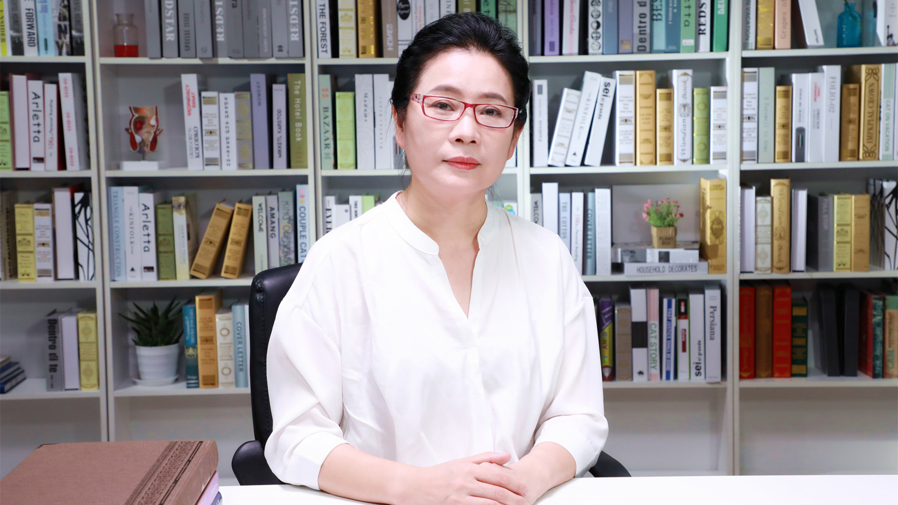

# 1.16 产后乳腺炎

---

## 李广隽 主任护师

首都医科大学附属北京妇产医院围产医学部总护士长；

北京护理学会妇产科专业委员会委员；北京中西医结合护理专业委员会委员；中国生命协会国际母乳哺育学部副主任委员；中国妇幼保健协会妇幼健康职业（岗位）培训基地授课专家；世界中联产后康养专业委员会常务理事。

**主要成就：** 副主编/参编专著6部；发表核心期刊论文9篇。

**专业特长：** 从事孕产妇及新生儿临床护理及管理30余年，具有丰富的孕产妇及新生儿护理经验。

---

## 产后为什么容易得乳腺炎？

（采访）为什么产后容易发生乳腺炎？

分娩以后会分泌乳汁，乳汁如果分泌的特别多，但是产妇又没有及时地，比如让孩子吸吮，或者吸吮得很充分，造成乳汁淤积。如果乳腺管不通的话，有一些乳汁过度的充盈了，充盈以后就渗透到乳腺周围组织，身体就把乳汁当成一种异物，乳汁中也是含有可以引起炎症的物质的，可以产生乳腺炎，这是其中一种，叫非感染性的乳腺炎。

在这个基础上，如果有乳头皲裂，吸吮过程当中，比如姿势不正确，宝宝没有把乳头和部分乳晕都含在嘴里边，可能就造成乳头皲裂，如果再不注意哺乳卫生，造成细菌感染，造成了细菌感染性乳腺炎。

（采访）乳腺炎一般产后多久会发生？

产后乳腺炎的发生，根据产妇哺乳的情况不同，发生的时间也是不一样的，不能一概而论。

一般情况下发生在产后一个月之内，最常发生的就是产后三四周的时候，一般产后三个月之内如果发生乳腺炎的话，一般判断成哺乳期产后乳腺炎，如果超过三个月，跟普通的乳腺炎鉴别一下。

---
